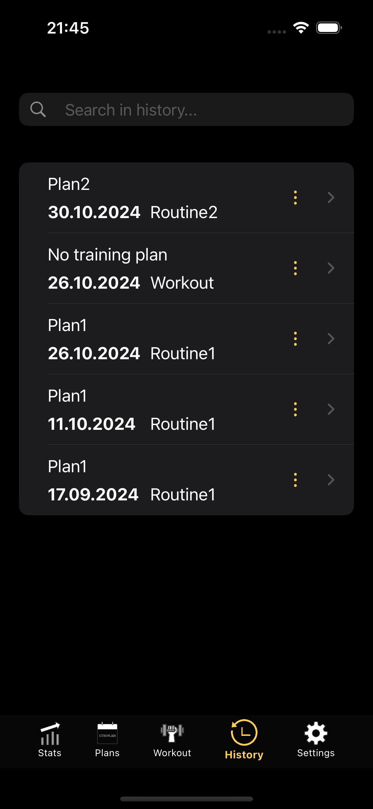

# LiftHub
LiftHub is a comprehensive fitness app that helps you design personalized training plans, create workout routines, and track your gym progress—all in one place.

## Table of Contents
- [Screenshots](#screenshots)
- [Feautures](#feautures)
- [License](#license)

## Screenshots

  
  
  
  
  
  
  

Note:
Stats view which you can see as the 5th main view is still in develpoment

## Features
- Creation and management of training plans
- Workout tracking and history review
- Data saved to database
- Support for different weight units and intensity metrics based on your preferences
- Light and dark mode
- Charts for lifted weight data to better visualize progress (Coming soon for iOS; available in Android version)
  
## License

All rights reserved. This project is proprietary, and no permission is granted to use, modify, or distribute the code or other parts of the repository without explicit written consent from the owner.
